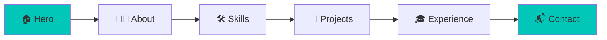

<div align="center">

# 🚀 Maruf Dev Portfolio

### ✨ A Modern Full Stack Developer Portfolio ✨

[](https://maruf-dev-portfolio.vercel.app/)
[](https://github.com/your-username/maruf-dev-portfolio)
[](LICENSE)


 ---
 **🌐 Website:** [maruf-dev-portfolio.vercel.app](https://maruf-dev-portfolio.vercel.app/)
 ---
*Showcasing innovation, creativity, and technical excellence*

</div>

---

## 📖 About The Project

A **sleek, modern, and fully responsive** portfolio website crafted to showcase my journey as a **Full Stack Web Developer**. This platform highlights:

- 💻 **Technical Skills** – Comprehensive tech stack mastery
- 📂 **Featured Projects** – Real-world applications and case studies
- 🎓 **Educational Background** – Academic achievements
- 🧑‍💼 **Professional Experience** – Career milestones
- 📞 **Easy Contact** – Multiple ways to connect

> **Mission:** Create an impactful online presence that resonates with recruiters, clients, and fellow developers.

---

## 🛠️ Tech Stack

<div align="center">

### Frontend Framework


### Styling & UI


### Animation & Interactions


### Deployment & Tools


</div>

---

## ✨ Key Features

<table>
<tr>
<td width="50%">

### 🎨 Design & UX
- ⚡ Lightning-fast performance
- 🎯 Pixel-perfect responsiveness
- 🌓 Modern UI/UX principles
- 🎭 Stunning GSAP animations
- 🌊 Smooth Lenis scrolling
- 📱 Mobile-first approach

</td>
<td width="50%">

### 🚀 Technical
- ⚙️ SEO optimized
- 🔄 Buttery-smooth transitions
- 📊 Analytics ready
- ♿ Accessibility compliant
- 🎪 Interactive micro-interactions
- 🔒 Secure & reliable

</td>
</tr>
</table>

---

## 🎯 Animation Features

This portfolio leverages industry-leading animation libraries for an exceptional user experience:

| Library | Purpose | Features Used |
|---------|---------|---------------|
| **🎬 GSAP** | Professional animations | ScrollTrigger, Timeline, Stagger effects |
| **🌊 Lenis** | Smooth scrolling | Buttery-smooth scroll, Momentum-based physics |
| **⚡ Framer Motion** | React animations | Page transitions, Gesture animations |
| **🎨 React Icons** | Icon library | Consistent iconography, Multiple icon sets |

---

## 📸 Portfolio Sections



| Section | Description | Animation Tech |
|---------|-------------|----------------|
| 🏠 **Hero** | Eye-catching intro with headline & CTA | GSAP + Framer Motion |
| 👨‍💻 **About Me** | Professional background & passion | Lenis Scroll |
| 🛠️ **Skills** | Tech stack & competencies | GSAP Stagger |
| 📂 **Projects** | Featured work with live demos | ScrollTrigger |
| 🎓 **Education** | Academic & professional journey | Smooth Parallax |
| 📬 **Contact** | Multiple ways to reach out | Hover Interactions |

---

## 🚀 Quick Start

### Prerequisites
```bash
node >= 14.0.0
npm >= 6.0.0
```

### Installation

```bash
# Clone the repository
git clone https://github.com/your-username/maruf-dev-portfolio.git

# Navigate to project
cd maruf-dev-portfolio

# Install dependencies
npm install
# or
yarn install
```

### Development

```bash
# Run development server
npm run dev
# or
yarn dev
```

Open [http://localhost:3000](http://localhost:3000) to view in browser.

### Build for Production

```bash
# Create optimized production build
npm run build
# or
yarn build

# Start production server
npm start
# or
yarn start
```

---

## 📦 Key Dependencies

```json
{
  "dependencies": {
    "next": "^14.x.x",
    "react": "^18.x.x",
    "react-dom": "^18.x.x",
    "framer-motion": "^10.x.x",
    "gsap": "^3.x.x",
    "@studio-freight/lenis": "^1.x.x",
    "react-icons": "^4.x.x",
    "tailwindcss": "^3.x.x"
  }
}
```

---

## 🎨 Animation Showcase

### GSAP Implementations
- **🎯 ScrollTrigger** - Pin sections, parallax effects, scroll-based reveals
- **⏱️ Timeline Animations** - Complex sequential animations
- **📊 Stagger Effects** - Elegant entrance animations for lists and grids
- **🎪 Hover Effects** - Interactive micro-interactions

### Lenis Smooth Scroll
- **🌊 Momentum-based** - Natural scroll physics
- **⚡ Performance** - Hardware-accelerated smoothness
- **🎯 Precision** - Pixel-perfect scroll control

### Framer Motion Features
- **🚪 Page Transitions** - Seamless route changes
- **👆 Gesture Handling** - Drag, hover, tap animations
- **🎭 Layout Animations** - Smooth layout shifts

---

## 📊 Project Stats

<div align="center">


</div>

---

## 🎓 What I Learned

Building this portfolio taught me:

- 🎬 **Advanced GSAP** - ScrollTrigger mastery and timeline orchestration
- 🌊 **Lenis Integration** - Implementing smooth scroll in React/Next.js
- ⚡ **Performance Optimization** - Balancing animations with performance
- 🎨 **Design Systems** - Creating cohesive UI with Tailwind + React Icons
- 🔧 **Modern Tooling** - Next.js 14 features and best practices

---

## 📬 Let's Connect

<div align="center">

[](mailto:your-email@example.com)
[](https://maruf-dev-portfolio.vercel.app/)
[](https://github.com/your-username)
[](https://linkedin.com/in/your-profile)
[](https://twitter.com/your-handle)


</div>

---

## 🤝 Contributing

Contributions, issues, and feature requests are welcome!

1. Fork the Project
2. Create your Feature Branch (`git checkout -b feature/AmazingFeature`)
3. Commit your Changes (`git commit -m 'Add some AmazingFeature'`)
4. Push to the Branch (`git push origin feature/AmazingFeature`)
5. Open a Pull Request

---

## 📜 License

Distributed under the MIT License. See `LICENSE` for more information.

---

## 🙏 Acknowledgments

Special thanks to:

- [**GSAP**](https://greensock.com/gsap/) - For professional-grade animations
- [**Lenis**](https://github.com/studio-freight/lenis) - For buttery-smooth scrolling
- [**Framer Motion**](https://www.framer.com/motion/) - For React animation primitives
- [**React Icons**](https://react-icons.github.io/react-icons/) - For beautiful icons
- [**Vercel**](https://vercel.com/) - For seamless deployment

---

## ⭐ Show Your Support

If you found this project helpful or inspiring, please consider:

- ⭐ **Starring** the repository
- 🔀 **Forking** for your own use
- 📢 **Sharing** with others
- 💬 **Providing feedback**
- 🐛 **Reporting bugs**

---

<div align="center">

### 🧑‍💻 Crafted with 💙 by **Maruf (md maruf)**

**Full Stack Web Developer | MERN Stack Enthusiast | Animation Lover**

[](https://github.com/your-username)

---

**"First, solve the problem. Then, write the code." – John Johnson**

Made with ❤️ using Next.js, GSAP, Lenis, and Framer Motion

⬆️ [Back to Top](#-maruf-dev-portfolio)

</div>
